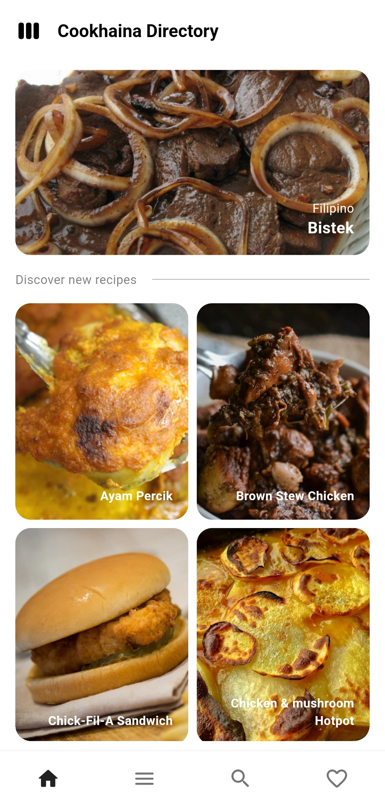
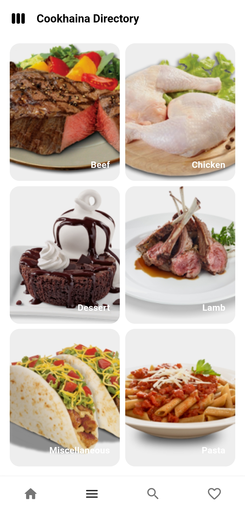
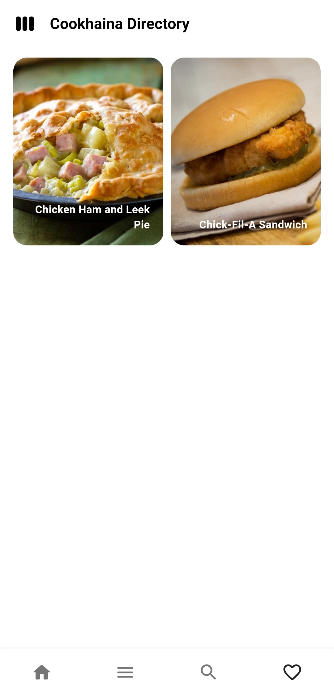
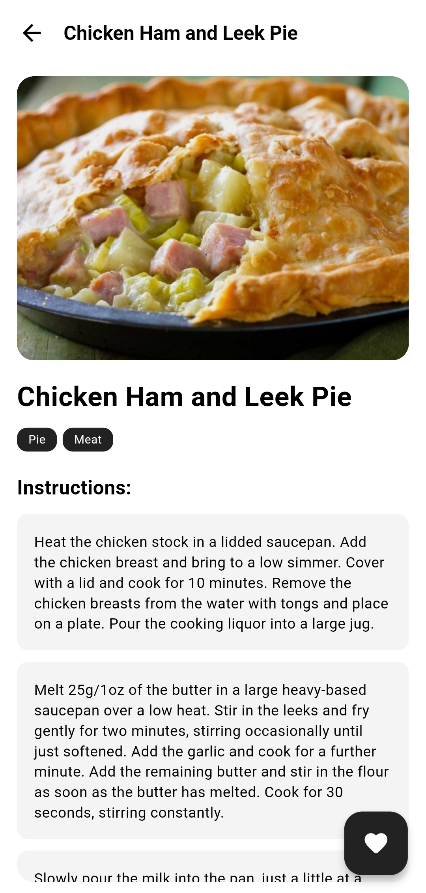

# Cookhaina Directory - Your Digital Cookbook
Cookhaina Directory is a delightful Flutter application that serves as your personal digital cookbook. Whether you're an experienced chef or just starting in the kitchen, Cookhaina Directory helps you organize your recipes, plan meals, and discover new culinary adventures powered by [TheMealDB API](https://www.themealdb.com/).

A course requirement in CS Elective 3.

Project members:
* Cabrera, Jen Jade B.
* Rubia, Johaina

Download the app: [cookhaina-directory.apk](https://github.com/monoaru/cookhaina-directory-flutter/releases/download/v1.0.0/cookhaina-directory.apk)

## Features
* **Discover New Recipes:** Browse through a collection of recipes, curated to inspire your next meal.
* **Browse by Category:** Easily explore recipes based on specific categories such as meal type, dietary preferences, or occasions.
* **Filter by Main Ingredient:** Quickly narrow down recipe options by selecting a main ingredient such as chicken, pasta, tofu, or broccoli. This feature helps users find recipes based on what ingredients they have on hand or their preference for a specific ingredient.
* **Favorite:** Mark recipes as favorites to easily access them later. Whether it's a tried-and-true family recipe or a new discovery you loved, the Favorite feature lets you save and revisit recipes with just a tap or click.

## Preview
<p float="left">
  
  
  
  
  
</p>

## License
```
MIT License

Copyright (c) 2024 hyoaru

Permission is hereby granted, free of charge, to any person obtaining a copy
of this software and associated documentation files (the "Software"), to deal
in the Software without restriction, including without limitation the rights
to use, copy, modify, merge, publish, distribute, sublicense, and/or sell
copies of the Software, and to permit persons to whom the Software is
furnished to do so, subject to the following conditions:

The above copyright notice and this permission notice shall be included in all
copies or substantial portions of the Software.

THE SOFTWARE IS PROVIDED "AS IS", WITHOUT WARRANTY OF ANY KIND, EXPRESS OR
IMPLIED, INCLUDING BUT NOT LIMITED TO THE WARRANTIES OF MERCHANTABILITY,
FITNESS FOR A PARTICULAR PURPOSE AND NONINFRINGEMENT. IN NO EVENT SHALL THE
AUTHORS OR COPYRIGHT HOLDERS BE LIABLE FOR ANY CLAIM, DAMAGES OR OTHER
LIABILITY, WHETHER IN AN ACTION OF CONTRACT, TORT OR OTHERWISE, ARISING FROM,
OUT OF OR IN CONNECTION WITH THE SOFTWARE OR THE USE OR OTHER DEALINGS IN THE
SOFTWARE.
```

## Disclaimer
The developer of this application does not have any affiliation with the content providers available.