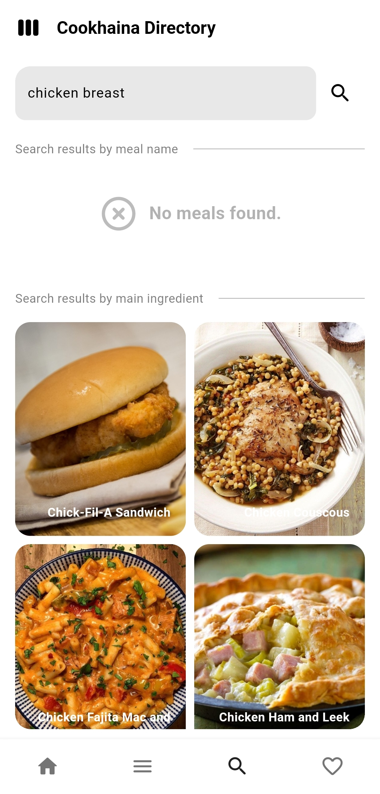

# Cookhaina Directory - Your Digital Cookbook
Cookhaina Directory is a delightful Flutter application that serves as your personal digital cookbook. Whether you're an experienced chef or just starting in the kitchen, Cookhaina Directory helps you organize your recipes, plan meals, and discover new culinary adventures powered by [TheMealDB API](https://www.themealdb.com/).

A course requirement in CS Elective 3.

Project members:
* Cabrera, Jen Jade B.
* Rubia, Johaina

Download the app: [cookhaina-directory.apk](https://github.com/monoaru/cookhaina-directory-flutter/releases/download/v1.0.0/cookhaina-directory.apk)

## Features
* **Discover New Recipes:** Browse through a collection of recipes, curated to inspire your next meal.
* **Browse by Category:** Easily explore recipes based on specific categories such as meal type, dietary preferences, or occasions.
* **Filter by Main Ingredient:** Quickly narrow down recipe options by selecting a main ingredient such as chicken, pasta, tofu, or broccoli. This feature helps users find recipes based on what ingredients they have on hand or their preference for a specific ingredient.
* **Favorite:** Mark recipes as favorites to easily access them later. Whether it's a tried-and-true family recipe or a new discovery you loved, the Favorite feature lets you save and revisit recipes with just a tap or click.

## Preview
<div style="display:flex">
  <div style="flex:1;padding-right:10px;">
    
  </div>
  <div style="flex:1;padding-right:10px;">
    
  </div>
  <div style="flex:1;">
    
  </div>
</div>
<div style="display:flex">
  <div style="flex:1;padding-right:10px;">
    
  </div>
  <div style="flex:1;">
    
  </div>
  <div style="flex:1;width:150px;">
  </div>
</div>

## License
```
```

## Disclaimer
The developer of this application does not have any affiliation with the content providers available.